# 🏃‍♂️ Real-Time IMU Human Activity Recognition (HAR) Server

[](.python-version)
[](https://flask.palletsprojects.com/)
[](https://tensorflow.org/)
[](https://www.espressif.com/)
[](#license)

A high-performance, real-time **Human Activity Recognition (HAR)** backend server designed for IoT edge devices (ESP32, Arduino, Raspberry Pi, smartwatches) and mobile/web client dashboards. 

The server streams 6-axis Inertial Measurement Unit (**IMU**) sensor readings (3-axis Accelerometer + 3-axis Gyroscope), buffers them into sliding temporal windows, normalizes the signals using precomputed statistical distributions, and classifies movements in real-time using an optimized **1D Deep Convolutional Neural Network (CNN)**.

---

## 📑 Table of Contents

- [Overview](#-overview)
- [System Architecture](#-system-architecture)
- [Classified Activities](#-classified-activities)
- [Model Architecture & Pipeline](#-model-architecture--pipeline)
- [Repository Structure](#-repository-structure)
- [Getting Started](#-getting-started)
  - [Prerequisites](#prerequisites)
  - [Installation](#installation)
  - [Running the Server](#running-the-server)
- [API Reference](#-api-reference)
  - [1. Stream IMU Data](#1-stream-imu-data)
  - [2. Fetch Latest Prediction](#2-fetch-latest-prediction)
  - [3. Health Check](#3-health-check)
- [ESP32 Client Example](#-esp32-client-example)
- [Production Deployment](#-production-deployment)
- [License](#-license)

---

## 🌟 Overview

- **Edge-to-Server Streaming**: Ingests high-frequency accelerometer and gyroscope readings (`ax`, `ay`, `az`, `gx`, `gy`, `gz`) via lightweight JSON HTTP POST requests.
- **Sliding Window Buffering**: Collects a rolling temporal window of **100 consecutive samples** (~1–2 seconds of movement depending on sampling frequency).
- **Z-Score Normalization**: Features are standardized on-the-fly using precomputed mean (`imu_mean.npy`) and standard deviation (`imu_std.npy`) arrays to guarantee robust model convergence and prediction accuracy.
- **Deep 1D-CNN Inference**: Classifies 6 complex physical activities with instant confidence scoring.
- **Client Polling Endpoint**: Provides `/latest` for mobile apps (Flutter, React Native, Android, iOS) or web dashboards to monitor live user activity states without latency.
- **Legacy / Baseline Support**: Includes an auxiliary serialized Random Forest classifier (`walking_jogging_model.pkl`) for comparative benchmarking and fast binary classification.

---

## 🏗 System Architecture

```mermaid
flowchart LR
    subgraph EdgeDevice ["Edge Hardware (e.g. ESP32)"]
        IMU["6-Axis IMU Sensor\n(MPU-6050 / BNO055)\n[ax, ay, az, gx, gy, gz]"]
        HTTPClient["HTTP Client\n(WiFi / Cellular)"]
        IMU --> HTTPClient
    end

    subgraph ServerBackend ["Flask HAR Backend Server (:5000)"]
        Ingest["POST /imu\nSample Ingestion"]
        Buffer["Window Buffer\n(100 Samples)"]
        ZNorm["Z-Score Normalizer\n(imu_mean.npy, imu_std.npy)"]
        CNN["1D CNN Keras Model\n(imu_activity_cnn.keras)"]
        State["Latest State Storage\n(activity, confidence, timestamp)"]

        HTTPClient --> Ingest
        Ingest --> Buffer
        Buffer -- "When buffer == 100" --> ZNorm
        ZNorm --> CNN
        CNN --> State
    end

    subgraph Consumers ["Client Applications"]
        Mobile["Mobile App (iOS / Android)"]
        Web["Analytics Dashboard"]
        
        State -. "GET /latest" .-> Mobile
        State -. "GET /latest" .-> Web
    end
```



---

## 🏷 Classified Activities

The model recognizes 6 distinct dynamic and stationary human physical activities mapped via [`activity_names.json`](activity_names.json):

| Class ID | Activity Name | Description | Motion Profile |
|:---:|:---|:---|:---|
| `0` | **Walking Upstairs** | Ascending staircases | Periodic vertical acceleration with pronounced forward surge |
| `1` | **Walking Downstairs**| Descending staircases | Rhythmic gravitational impacts with downward acceleration peaks |
| `2` | **Walking** | Normal ground-level walking | Regular cyclic peaks across longitudinal accelerometer axes |
| `3` | **Sitting** | Stationary sedentary posture | Static gravitational reading along one axis, minimal angular rate |
| `4` | **Standing** | Upright stationary posture | Near-zero gyroscope deviation, constant gravity vector alignment |
| `5` | **Jogging** | High-cadence running motion | High-amplitude, high-frequency acceleration & angular velocity waves |

---

## 🧠 Model Architecture & Pipeline

### 1D Convolutional Neural Network (CNN)

The primary inference engine is loaded from [`imu_activity_cnn.keras`](imu_activity_cnn.keras). It takes an input tensor of shape `(Batch_Size, 100, 6)`:

```
Input: (Batch, 100, 6)
  │
  ├──► Conv1D(filters=32, kernel_size=5, activation='relu') ──► (Batch, 96, 32)
  ├──► MaxPooling1D(pool_size=2)                             ──► (Batch, 48, 32)
  │
  ├──► Conv1D(filters=64, kernel_size=5, activation='relu') ──► (Batch, 44, 64)
  ├──► MaxPooling1D(pool_size=2)                             ──► (Batch, 22, 64)
  │
  ├──► Conv1D(filters=128, kernel_size=3, activation='relu')──► (Batch, 20, 128)
  ├──► GlobalAveragePooling1D()                              ──► (Batch, 128)
  │
  ├──► Dense(64, activation='relu')                          ──► (Batch, 64)
  ├──► Dropout(rate=0.5)                                     ──► (Batch, 64)
  │
  └──► Dense(6, activation='softmax')                        ──► (Batch, 6)
```

- **Total Parameters**: 133,940
- **Trainable Parameters**: 44,646 (~174 KB)
- **Signal Normalization**:
  $$\hat{X} = \frac{X - \mu}{\sigma + 10^{-8}}$$
  Where $\mu$ and $\sigma$ are defined in [`imu_mean.npy`](imu_mean.npy) and [`imu_std.npy`](imu_std.npy).

---

## 📂 Repository Structure

```plaintext
imu-activity-server/
│
├── .python-version             # Targeted Python version (3.12)
├── requirements.txt            # Python dependencies (Flask, NumPy, TensorFlow, Gunicorn)
│
├── imu_server.py               # Main Flask HTTP API server & real-time inference loop
│
├── imu_activity_cnn.keras      # Pre-trained 1D CNN multi-class classifier model
├── imu_mean.npy                # Feature-wise training mean values (shape: 1, 1, 6)
├── imu_std.npy                 # Feature-wise training standard deviations (shape: 1, 1, 6)
├── activity_names.json         # Class index to label mapping JSON dictionary
│
├── walking_jogging_model.pkl   # Serialized Random Forest classifier (baseline/benchmark)
└── README.md                   # Project documentation
```

---

## 🚀 Getting Started

### Prerequisites

- Python 3.12 (or 3.10+)
- Edge device with an IMU sensor (e.g., ESP32 + MPU-6050) or a testing script (Postman/curl)

### Installation

1. **Clone the repository**:
   ```bash
   git clone https://github.com/your-username/imu-activity-server.git
   cd imu-activity-server
   ```

2. **Create and activate a virtual environment**:
   ```bash
   # Windows (PowerShell)
   python -m venv .venv
   .venv\Scripts\Activate.ps1

   # Linux / macOS
   python3 -m venv .venv
   source .venv/bin/activate
   ```

3. **Install dependencies**:
   ```bash
   pip install -r requirements.txt
   ```

### Running the Server

Start the development server:

```bash
python imu_server.py
```

By default, the server binds to `0.0.0.0:5000`. You will see:

```text
==========================================
        IMU ACTIVITY CNN SERVER
==========================================
Model      : 1D CNN
Activities : 6
Window     : 100 samples
Server     : http://<your-ip>:5000
==========================================
Waiting for ESP32...
```

---

## 📡 API Reference

### 1. Stream IMU Data
Ingests a single 6-axis IMU reading.

- **Endpoint**: `POST /imu`
- **Headers**: `Content-Type: application/json`
- **Payload Parameters**:
  - `ax`: Accelerometer X-axis value (`float`)
  - `ay`: Accelerometer Y-axis value (`float`)
  - `az`: Accelerometer Z-axis value (`float`)
  - `gx`: Gyroscope X-axis value (`float`)
  - `gy`: Gyroscope Y-axis value (`float`)
  - `gz`: Gyroscope Z-axis value (`float`)

#### Example Request:
```bash
curl -X POST http://localhost:5000/imu \
  -H "Content-Type: application/json" \
  -d '{
    "ax": 124.0,
    "ay": -58.0,
    "az": 1024.0,
    "gx": 3.2,
    "gy": -1.1,
    "gz": 0.4
  }'
```

#### Response (While accumulating window `< 100`):
```json
{
  "status": "collecting",
  "samples": 42,
  "window_size": 100
}
```

#### Response (When window reaches `100` samples):
```json
{
  "status": "prediction",
  "activity": "Walking",
  "confidence": 98.45,
  "timestamp": "2026-09-28T07:15:30.123456+00:00"
}
```

---

### 2. Fetch Latest Prediction
Polls the latest classified activity state. Ideal for mobile apps and dashboards.

- **Endpoint**: `GET /latest`
- **Response**:
```json
{
  "status": "prediction",
  "activity": "Jogging",
  "confidence": 95.82,
  "timestamp": "2026-09-28T07:16:02.847192+00:00",
  "samples": 18,
  "window_size": 100
}
```

---

### 3. Health Check
Verifies service availability and model status.

- **Endpoint**: `GET /health`
- **Response**:
```json
{
  "status": "online",
  "model": "1D CNN",
  "activities": 6
}
```

---

## 🔌 ESP32 Client Example

Here is a ready-to-use Arduino C++ sketch for an **ESP32** equipped with an **MPU-6050** sensor:

```cpp
#include <WiFi.h>
#include <HTTPClient.h>
#include <Wire.h>
#include <MPU6050.h>
#include <ArduinoJson.h>

const char* ssid     = "YOUR_WIFI_SSID";
const char* password = "YOUR_WIFI_PASSWORD";
const char* serverUrl = "http://192.168.1.100:5000/imu"; // Set to your server IP

MPU6050 mpu;

void setup() {
  Serial.begin(115200);
  Wire.begin();
  mpu.initialize();

  WiFi.begin(ssid, password);
  while (WiFi.status() != WL_CONNECTED) {
    delay(500);
    Serial.print(".");
  }
  Serial.println("\nWiFi Connected!");
}

void loop() {
  if (WiFi.status() == WL_CONNECTED) {
    int16_t ax, ay, az, gx, gy, gz;
    mpu.getMotion6(&ax, &ay, &az, &gx, &gy, &gz);

    HTTPClient http;
    http.begin(serverUrl);
    http.addHeader("Content-Type", "application/json");

    StaticJsonDocument<200> doc;
    doc["ax"] = (float)ax;
    doc["ay"] = (float)ay;
    doc["az"] = (float)az;
    doc["gx"] = (float)gx;
    doc["gy"] = (float)gy;
    doc["gz"] = (float)gz;

    String requestBody;
    serializeJson(doc, requestBody);

    int httpCode = http.POST(requestBody);
    if (httpCode > 0) {
      String response = http.getString();
      Serial.println(response);
    }
    http.end();
  }
  delay(20); // ~50 Hz sampling rate
}
```

---

## 🛡 Production Deployment

For reliable production serving, use **Gunicorn** with multiple worker processes or gevent workers:

```bash
gunicorn -w 4 -b 0.0.0.0:5000 imu_server:app
```

> [!TIP]
> If multiple devices send data simultaneously or if using multiple worker threads, consider migrating the in-memory `samples` buffer to an in-memory cache such as **Redis** keyed by device ID (`device_id`).

---

## 📄 License

This project is licensed under the [MIT License](LICENSE) - feel free to use, modify, and distribute for personal, academic, or commercial applications.
